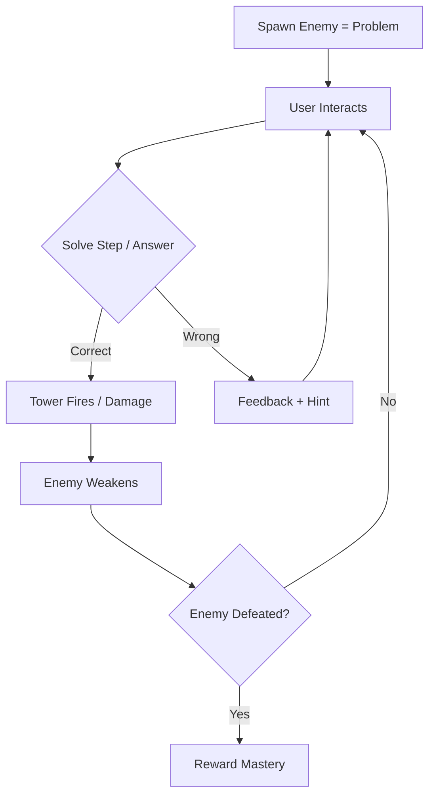

# 📘 Zupiq Educational Game Engine Spec  
**Version:** 1.0  
**Project:** Quantum Prism (Learning Mode Integration)  
**Goal:** Transform tower-defense gameplay into a **learning-driven system** that trains student thinking and tracks mastery.

---

## 🎯 1. Core Philosophy

> The game must reward **correct thinking**, not just interaction.

### Transformation Mapping

| Current Game | Educational Version |
|------|----------------|
| Enemy | Problem / Challenge |
| Tower | Subject Skill (Math, Physics, Logic…) |
| Attack | Correct reasoning step |
| Damage | Progress toward solving problem |
| XP / Energy | Mastery + Cognitive reward |
| Wave | Learning session |

---

## 🧩 2. Core Gameplay Loop (REQUIRED)



---

## 🧠 3. Learning Engine Integration

### 3.1 Problem Structure

```ts
type Problem = {
  id: string;
  subject: "math" | "physics" | "logic" | "bio";
  difficulty: number;
  question: string;
  steps: Step[];
  correctAnswer: string;
  explanation: string;
};
```

```ts
type Step = {
  id: string;
  prompt: string;
  options?: string[];
  correct: string;
  hint?: string;
};
```

---

### 3.2 Enemy = Problem Mapping

Each enemy must carry a learning payload:

```ts
type Enemy = {
  id: string;
  type: "logic_error" | "noise" | "bias" | "complex";
  problem: Problem;
  health: number;
  weakness: SubjectType;
};
```

---

## 🏰 4. Tower System Redesign

### 4.1 Tower = Skill

```ts
type Tower = {
  id: string;
  subject: "math" | "physics" | "logic" | "bio";
  level: number;
  masteryRequired: number;
};
```

---

### 4.2 Attack Condition (CRITICAL CHANGE)

❌ OLD:
```ts
tower.autoAttack(enemy);
```

✅ NEW:
```ts
if (userAnswersCorrect(problemStep)) {
  tower.fire(enemy);
}
```

---

## ⚡ 5. Interaction Rules

### 5.1 Enemy Click Behavior (MANDATORY CHANGE)

❌ REMOVE:
- instant kill
- free energy gain

✅ REPLACE WITH:
```ts
onEnemyClick(enemy):
  openProblemModal(enemy.problem)
```

---

### 5.2 Problem Modal Behavior

- Show question
- Guide step-by-step
- Require input before progressing

```ts
onSubmitAnswer(answer):
  if (correct):
    triggerAttack()
  else:
    showHint()
```

---

## 📊 6. Mastery System (CORE FEATURE)

### 6.1 Data Model

```ts
type Mastery = {
  subject: string;
  accuracy: number;
  attempts: number;
  streak: number;
  level: number;
};
```

---

### 6.2 Update Logic

```ts
if (correct):
  mastery.accuracy += 1
  mastery.streak += 1
else:
  mastery.streak = 0
```

---

### 6.3 UI Requirements

- Show mastery % per subject
- Show weak areas
- Show improvement trend

---

## 🤖 7. AI Integration Layer

### 7.1 AI Responsibilities

- Generate problems
- Break into steps
- Detect mistake patterns
- Provide feedback

---

### 7.2 AI API Contract

```ts
POST /ai/generate-problem

{
  subject: string;
  difficulty: number;
}
```

```ts
Response:
{
  problem: Problem;
}
```

---

### 7.3 Evaluation API

```ts
POST /ai/evaluate

{
  problemId: string;
  userAnswer: string;
}
```

---

## 🎮 8. Game Modes

### 8.1 Learn Mode
- step-by-step guidance
- no time pressure

### 8.2 Practice Mode
- medium difficulty
- light feedback

### 8.3 Challenge Mode
- timed waves
- mixed subjects
- minimal hints

---

## ⚠️ 9. Critical Rules (DO NOT BREAK)

1. ❌ No reward without solving
2. ❌ No bypass (no instant kill mechanics)
3. ❌ No guessing loops
4. ✅ Every action must involve thinking
5. ✅ Feedback must be immediate and clear

---

## 🚀 10. Migration Plan (From Current Code)

### Phase 1 (Immediate)
- Replace `handleEnemyClick`
- Attach `problem` to enemy
- Add problem modal

### Phase 2
- Connect AI generation
- Add step-by-step solving

### Phase 3
- Add mastery tracking
- Add analytics

### Phase 4
- Balance gameplay
- Optimize difficulty curve

---

## 🧠 11. Success Metrics

The system is successful if:

- Users improve accuracy over time
- Users spend time thinking, not tapping
- Weak areas are clearly identified
- Retention increases due to progression

---

## 💡 Final Note

This system is NOT a game with education.

It is:
> **A thinking training system disguised as a game.**
